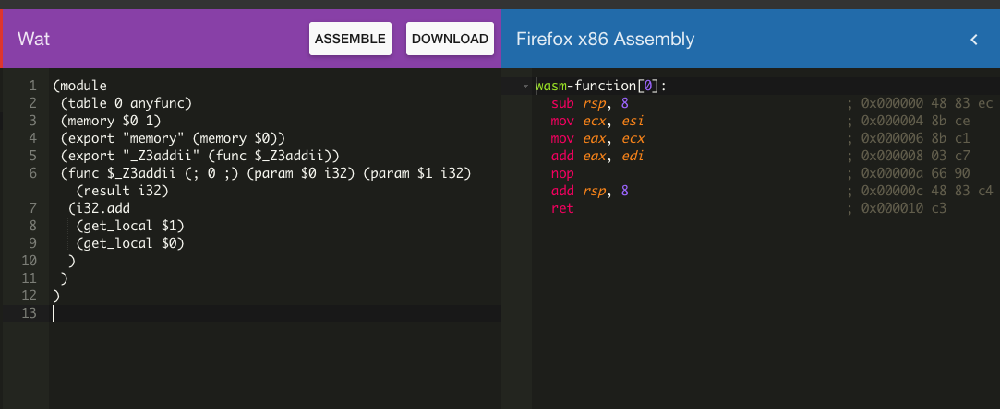
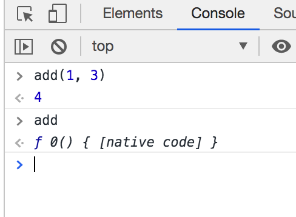
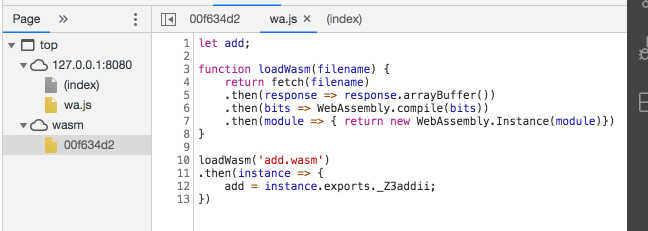
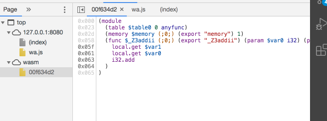

# wasm-tutorial
뭔가 wasm이 너무 끌린다. 살면서 이렇게 뭔가 기술을 배우고싶었던 적이 없는데, 처음 느껴보는 이 강렬한 이끌림


# 튜토리얼
https://www.youtube.com/watch?v=LNqicUieSqI&ab_channel=ChrisHawkes 의 강의를 따라했습니다. 


```
npm install -g http-server
http-server
```

간단한 튜토리얼인데 너무 신기하다!!!!!! 

1. https://mbebenita.github.io/WasmExplorer/ 에서 아주 간단한 c++ 작업을 했다. 
```
int add(int num1, int num2) {
  return num1+num2;
}
```



이런식으로 wat으로 변환후 assembly로 변환된다고 하는데 각각의 역할에 대해서는 아직 추가적인 학습이 필요하다. 

여튼 저 Wat을 다운로드 받아온다. 


2. add.wasm 파일이라고 이름을 지었는데, 이 wasm 파일을 어떻게 읽을 것인가?
```
let add;

function loadWasm(filename) {
    return fetch(filename)
    .then(response => response.arrayBuffer())
    .then(bits => WebAssembly.compile(bits))
    .then(module => { return new WebAssembly.Instance(module)})
}

loadWasm('add.wasm')
.then(instance => {
    add = instance.exports._Z3addii;
})
```

아래와 같은 흐름으로 읽는다고 한다. `_Z3addii` 이건 난데없는 이름이긴한데, 명명규칙이 이렇다고 한다. 

여튼 이제 얘를 html 파일에서 스크립트를 로드만 해주면 브라우저에서 확인이 가능하다. 


3. 브라우저에서 확인하면 아래와 같다. 
- 

- 

- 

이런식으로 브라우저에 c++ 코드를 가져올 수 있다. 


4. 후기 
   
엄청 짧은 튜토리얼이었지만, c++ 코드를 브라우저에 녹여낼 수 있다는게 뭔가 믿기지가 않는다. 자바스크립트도 재밌긴한데, 내가 아직 잘몰라서 그렇겠지만서도 평생 그냥 지금 생각하는 쇼핑몰 같은 웹사이트만 만든다라는게 좀 갑갑한 면이 있었다. 인공지능도 관심있고 그런데 뭘 적용해서 할 수 있는게 있나 싶기도 했고.. 그런데 wasm이든, wasm보다 더 좋은 뭔가가 나타나던 하면 웹에서 할 수 있는게 폭이 훨씬 넓어질것 같다는 생각이 들어서 좀 설렌다. 이게 말이 많긴하던데, 공부해보고 싶으니까 공부를 해야할 것 같다. 


